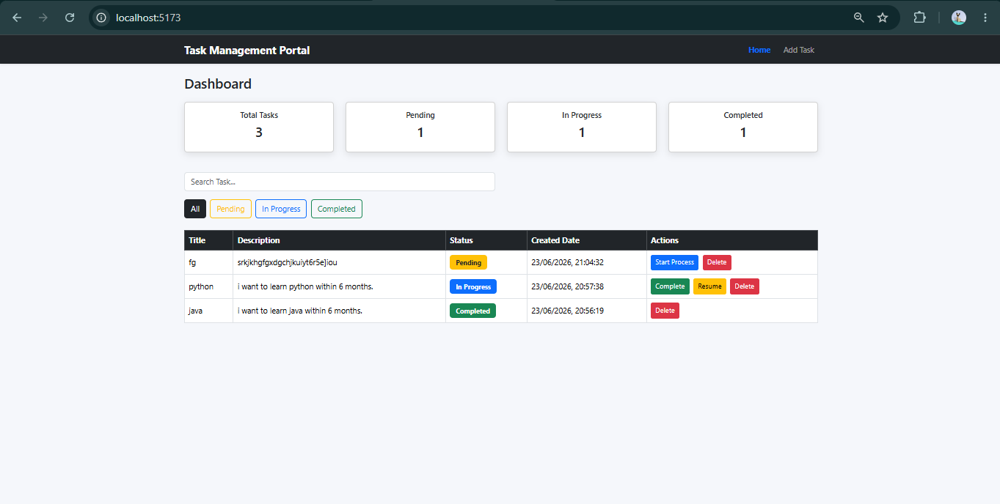
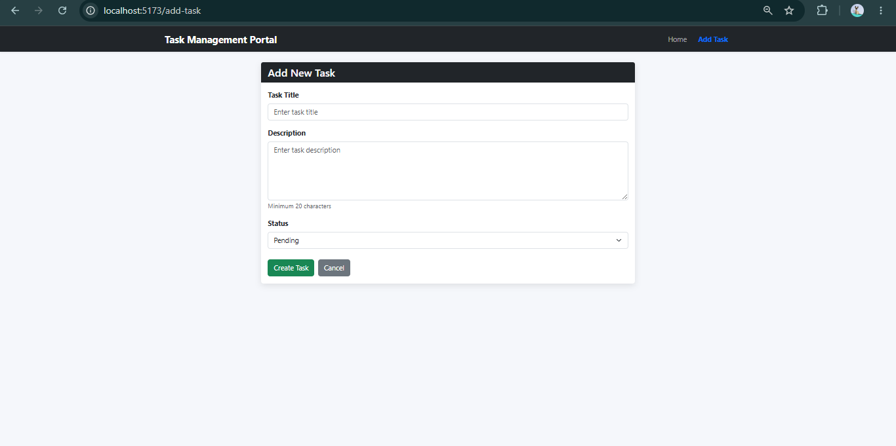
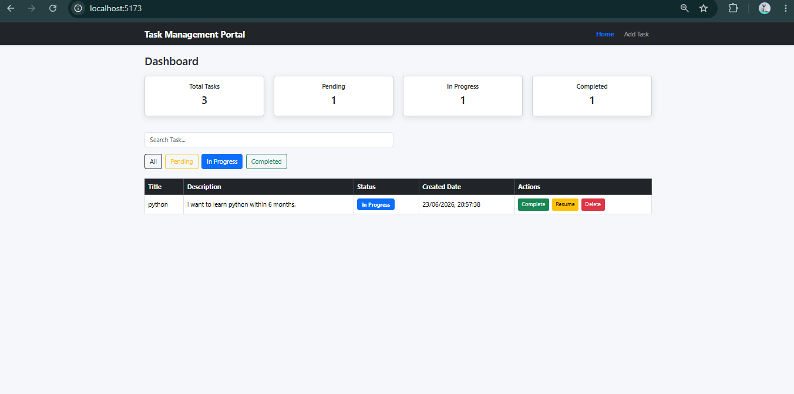
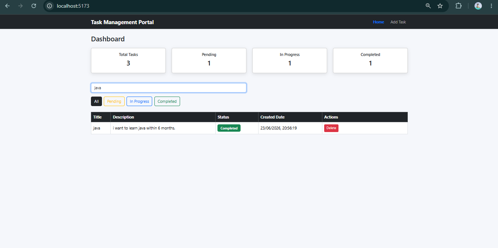

# Task Management Portal

A Full Stack Task Management Web Application built using React, Node.js, Express.js, MySQL, REST API, and Axios.

## Features

### Dashboard

* View all tasks
* Search tasks by title
* Filter tasks by status

  * All
  * Pending
  * In Progress
  * Completed
* Dashboard statistics

  * Total Tasks
  * Pending Tasks
  * In Progress Tasks
  * Completed Tasks

### Task Management

* Create new task
* Update task status
* Delete task
* Status workflow:

  * Pending → In Progress
  * In Progress → Completed
  * In Progress → Pending (Resume)

### Validation

* Title is required
* Description must contain at least 20 characters

### UI Features

* Responsive Design
* Bootstrap UI
* Loading Spinner
* Status Badges
* Confirmation before Delete

---

## Tech Stack

### Frontend

* React.js
* React Router DOM
* Axios
* Bootstrap

### Backend

* Node.js
* Express.js

### Database

* MySQL

### API

* REST API

---

## Project Structure

```text
task-management-portal
│
├── frontend
│   ├── src
│   │   ├── components
│   │   ├── pages
│   │   ├── services
│   │   ├── App.jsx
│   │   └── App.css
│   │
│   ├── .env
│   └── package.json
│
├── backend
│   ├── config
│   ├── controllers
│   ├── models
│   ├── routes
│   ├── server.js
│   └── .env
│
├── README.md
└── .gitignore
```

---

## Screenshots

### Dashboard



### Add Task Page



### Filter Tasks



### Search Tasks



---

## Database Schema

```sql
CREATE TABLE tasks(
    id INT PRIMARY KEY AUTO_INCREMENT,
    title VARCHAR(255) NOT NULL,
    description TEXT NOT NULL,
    status VARCHAR(50) NOT NULL,
    created_at TIMESTAMP DEFAULT CURRENT_TIMESTAMP
);
```

---

## API Endpoints

### Get All Tasks

```http
GET /tasks
```

### Create Task

```http
POST /tasks
```

Request Body:

```json
{
  "title": "Build Dashboard",
  "description": "Create dashboard page with statistics and filters",
  "status": "Pending"
}
```

### Update Task Status

```http
PUT /tasks/:id
```

Request Body:

```json
{
  "status": "Completed"
}
```

### Delete Task

```http
DELETE /tasks/:id
```

---

## Environment Variables

### Backend (.env)

```env
PORT=3000

DB_HOST=localhost
DB_USER=root
DB_PASSWORD=root
DB_NAME=task_management
```

### Frontend (.env)

```env
VITE_API_URL=http://localhost:3000
```

---

## Installation

### Clone Repository

```bash
git clone <repository-url>
```

### Backend Setup

```bash
cd backend

npm install

npm run dev
```

### Frontend Setup

```bash
cd frontend

npm install

npm run dev
```

---

## Author

Thamizharasan K

B.Tech Artificial Intelligence and Data Science

Vel Tech Engineering College

Chennai, India
